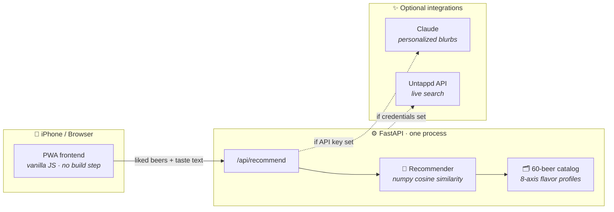

<div align="center">

# 🍺 Beer Recommender

### *Tell us what you drink. We'll pour the next round.*

Pick a few beers you love → get personalized, AI-explained recommendations —<br>
served as an app you can install on your iPhone in under a minute. **No App Store required.**


</div>

---

## ⚡ Why this exists

Standing in front of a wall of taps or a cooler full of unfamiliar cans, "what should I try next?" is a genuinely hard question. Rating apps tell you what *everyone* likes — not what *you'll* like.

**Beer Recommender** learns your palate from beers you already enjoy, matches it against a curated catalog of 60 classics across every major style, and explains *why* each pick fits you — in plain English, personalized by Claude.

## 🎯 What it does

| | Feature | How |
|---|---|---|
| 🧠 | **Learns your taste** | Every beer gets an 8-axis flavor fingerprint — hoppy, malty, bitter, sweet, roasty, fruity, sour, crisp — plus ABV/IBU. Your favorites are averaged into a taste profile. |
| 💬 | **Understands plain English** | Type *"juicy hazy IPAs, nothing too bitter"* and keyword parsing nudges your profile — no picks required. |
| 📊 | **Ranks by real similarity** | Cosine similarity (numpy) between your profile and every candidate, with a 2-per-style cap so you don't get five identical IPAs. |
| ✨ | **Explains every pick** | With an Anthropic API key, Claude (`claude-opus-4-8`) writes a one-line "why *you'll* like this" blurb per beer. Without a key? Smart template reasons — the app never breaks. |
| 📱 | **Installs like a native app** | Full PWA: home-screen icon, full-screen launch, offline shell caching. Zero App Store, zero developer account. |
| 🍻 | **Untappd-ready** | Drop in legacy Untappd API credentials and `/api/search` proxies live beer search. Without them, the bundled catalog covers everything. |

## 🚀 Try it in 60 seconds

```bash
git clone <this-repo> && cd beer-reccommender
uv sync
uv run python main.py
```

Open **http://localhost:8000** → tap a few beers you like → **Get my recommendations** 🍻

> Prefer hot-reload while hacking? `uv run uvicorn backend.main:app --reload`

## 📱 Put it on your iPhone

The server binds to `0.0.0.0`, so your phone can reach it over Wi-Fi:

1. **Start the server** on your Mac → `uv run python main.py`
2. **Find your Mac's IP** → `ipconfig getifaddr en0`
3. **On your iPhone** (same Wi-Fi), open Safari → `http://<your-mac-ip>:8000`
4. **Share → Add to Home Screen → Add**

You now have a **"Beers"** app: its own beer-mug icon, full-screen launch, no browser chrome.

<details>
<summary>🌐 <b>Want it working away from home?</b></summary>
<br>

iOS only enables the offline service-worker cache over HTTPS. On plain LAN HTTP the app still installs and runs full-screen — it just needs the server reachable. To use it anywhere (with full offline caching):

- **[Tailscale](https://tailscale.com)** → `tailscale serve 8000` (easiest — private HTTPS to all your devices)
- **Cloudflare Tunnel** → `cloudflared tunnel --url http://localhost:8000`
- **Deploy it** → Fly.io, Railway, or any VPS

</details>

## 🏗️ How it's built



**One command, one process.** FastAPI serves the JSON API *and* the frontend — no Node, no bundler, no separate deploy.

<details>
<summary>🔍 <b>The recommendation engine, in 30 seconds</b></summary>
<br>

1. Every beer in [`backend/data/beers.json`](backend/data/beers.json) carries a hand-tuned flavor vector: `[hoppy, malty, bitter, sweet, roasty, fruity, sour, crisp]` + normalized ABV/IBU.
2. Your liked beers are **averaged** into a taste profile ([`backend/recommender.py`](backend/recommender.py)).
3. Free-text like *"dark coffee stouts"* is parsed by a keyword→flavor-axis map (with negation handling — *"not bitter"* pushes bitterness **down**) and **blended in at 35%**.
4. Candidates are ranked by **cosine similarity**, your already-liked beers are excluded, and results are capped at two per style for variety.
5. If Claude is configured, one API call rewrites the reasons into personalized blurbs — and fails silently back to templates if anything goes wrong.

*Sanity checks that pass:* West Coast IPA lovers get Hop Slam & Racer 5 · "dark coffee chocolate" returns stouts & porters · "tart, not bitter" returns Flanders reds & goses.

</details>

<details>
<summary>🔌 <b>API reference</b></summary>
<br>

| Endpoint | Method | Description |
|---|---|---|
| `/api/health` | GET | Status, catalog size, whether Untappd is configured |
| `/api/beers` | GET | Full 60-beer catalog with flavor profiles |
| `/api/beers/{id}` | GET | One beer |
| `/api/search?q=` | GET | Beer search — Untappd if configured, local otherwise |
| `/api/recommend` | POST | `{"liked_beer_ids": [1,3], "taste_text": "hoppy", "limit": 5}` → ranked picks with reasons + match scores |

```bash
curl -X POST localhost:8000/api/recommend \
  -H 'Content-Type: application/json' \
  -d '{"liked_beer_ids": [1, 39], "taste_text": "piney west coast, nothing sweet"}'
```

</details>

<details>
<summary>🔑 <b>Optional API keys</b> (app is fully functional without them)</summary>
<br>

Create a `.env` at the repo root:

```bash
ANTHROPIC_API_KEY=sk-ant-...    # ✨ Claude-personalized recommendation blurbs
UNTAPPD_CLIENT_ID=...           # 🍻 live Untappd search (legacy API access only —
UNTAPPD_CLIENT_SECRET=...      #    Untappd closed new registrations)
```

Credentials never hit the logs — httpx request logging is muted and a redaction filter scrubs secrets from any line that slips through.

</details>

## 📁 Project layout

```
├── main.py                  # entrypoint → uvicorn on 0.0.0.0:8000
├── backend/
│   ├── main.py              # FastAPI app + static frontend mount
│   ├── recommender.py       # 🧠 numpy similarity engine + taste-text parsing
│   ├── catalog.py           # dataset loading & search
│   ├── ai.py                # ✨ optional Claude personalization
│   ├── untappd.py           # 🍻 optional Untappd proxy
│   └── data/beers.json      # 60 beers × 8-axis flavor profiles
└── frontend/                # 📱 PWA — plain HTML/CSS/JS, manifest, service worker, icons
```

---

<div align="center">

**Built with FastAPI · numpy · Claude · and a healthy appreciation for good beer** 🍺

*Drink responsibly. Recommend recklessly.*

</div>
